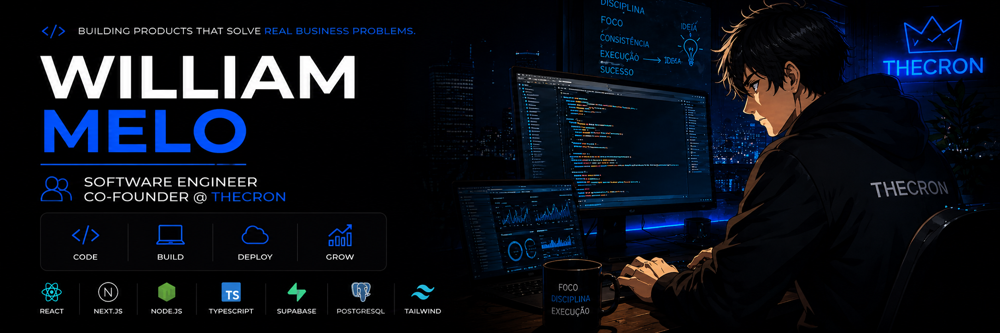

  

<h1 align="center">
William Melo
</h1>

Software Engineer • Co-Founder @ TheCRON

Building products that solve real business problems.

---

# About

I'm a Software Engineer and Co-Founder of **TheCRON**.

I design and build SaaS platforms, business management systems and automation solutions focused on solving real business problems.

My goal is to create software that is scalable, maintainable and capable of generating measurable value for companies.

I believe great software is not defined by the amount of code written, but by the problems it solves.

---

# What I'm Building

- SaaS Platforms

- Business Management Systems

- Automation Solutions

- Internal Tools

- Productivity Platforms

- Web Applications

---

# Tech Stack

### Front-end

### Back-end

### DevOps

### Tools

---

# Currently Learning

- Software Architecture

- Clean Architecture

- Design Patterns

- Distributed Systems

- Docker

- CI/CD

- Cloud Computing

- Performance Optimization

- Testing

---

## 📊 GitHub Analytics

---

# Development Philosophy

> Technology should solve problems, not create them.

I enjoy building software with long-term vision, focusing on simplicity, maintainability and user experience.

Rather than simply writing code, I strive to create products that improve people's work and generate real value for businesses.

---

# Current Goals

- Build scalable SaaS products

- Deepen my knowledge in Software Engineering

- Master System Architecture

- Contribute to Open Source

- Build products used by thousands of people

---

# Featured Projects

🚧 Coming soon...

---

# Let's Connect

<a href="https://thecron.com.br">

🌐 https://thecron.com.br

</a>

---

<b>Building software with purpose.</b>

